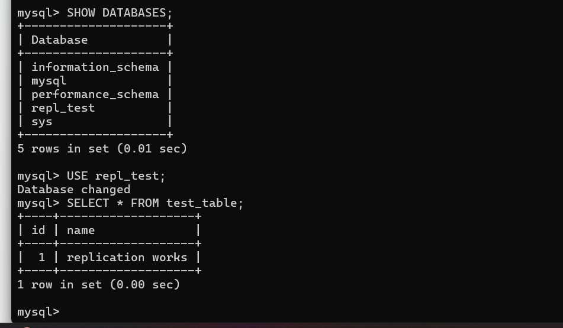
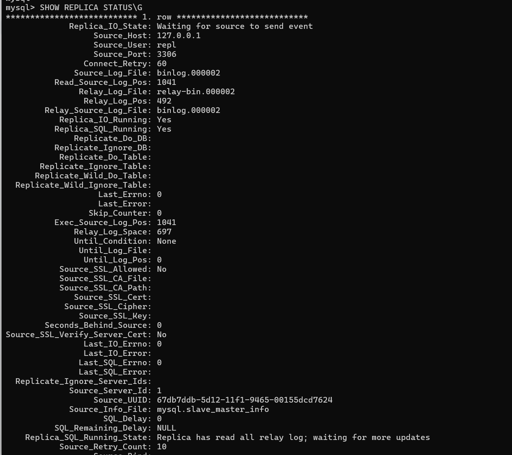
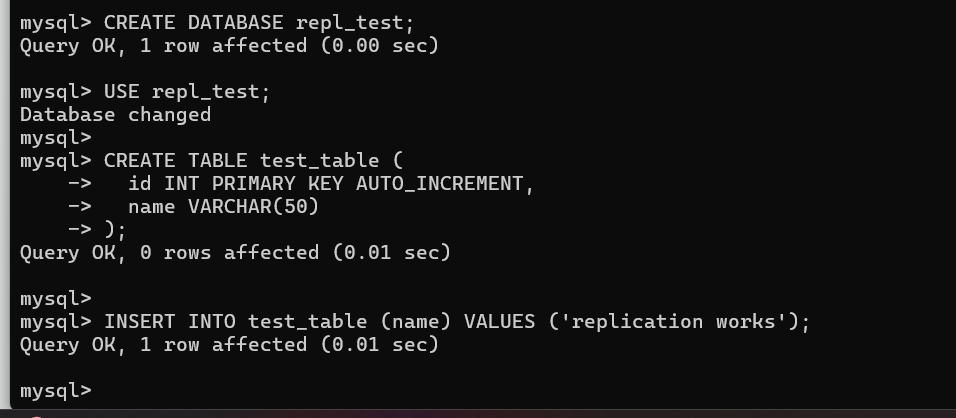

# Домашнее задание «Репликация и масштабирование. Часть 1»

## Задание 1

### Отличия Master-Slave и Master-Master

#### Master-Slave

В данной схеме один сервер является основным (Master), а второй — репликой (Slave).

Особенности:

- запись данных выполняется только на Master;
- чтение возможно как с Master, так и со Slave;
- изменения автоматически передаются на Slave;
- простая настройка и администрирование.

Преимущества:

- снижение нагрузки на основной сервер;
- повышение отказоустойчивости;
- возможность резервного копирования со Slave.

Недостатки:

- запись доступна только на Master;
- при отказе Master требуется переключение ролей.

#### Master-Master

В данной схеме оба сервера являются одновременно Master и Slave друг для друга.

Особенности:

- запись возможна на любой сервер;
- данные синхронизируются между узлами.

Преимущества:

- высокая отказоустойчивость;
- возможность распределения нагрузки на запись.

Недостатки:

- более сложная настройка;
- риск конфликтов данных при одновременной записи.

---

## Задание 2

### Настройка Master-Slave репликации

На локальном компьютере были подняты два экземпляра MySQL:

| Сервер | Порт |
|---------|---------|
| Master | 3306 |
| Slave | 3307 |

На Master был создан пользователь для репликации:

```sql
CREATE USER 'repl'@'localhost' IDENTIFIED BY 'replpass';
GRANT REPLICATION SLAVE ON *.* TO 'repl'@'localhost';
FLUSH PRIVILEGES;
```

Получены координаты бинарного лога:
```
SHOW BINARY LOG STATUS;
```
На Slave настроено подключение к Master и запущена репликация.

Проверка состояния:
```
SHOW REPLICA STATUS\G
```
Результат:
```
Replica_IO_Running: Yes
Replica_SQL_Running: Yes
Seconds_Behind_Source: 0
```
Для проверки работы репликации на Master была создана тестовая база:
```sql
CREATE DATABASE repl_test;
USE repl_test;

CREATE TABLE test_table (
    id INT PRIMARY KEY AUTO_INCREMENT,
    name VARCHAR(50)
);

INSERT INTO test_table(name)
VALUES ('replication works');
```
На Slave выполнена проверка:
```
SHOW DATABASES;
USE repl_test;
SELECT * FROM test_table;
```
Результат:




